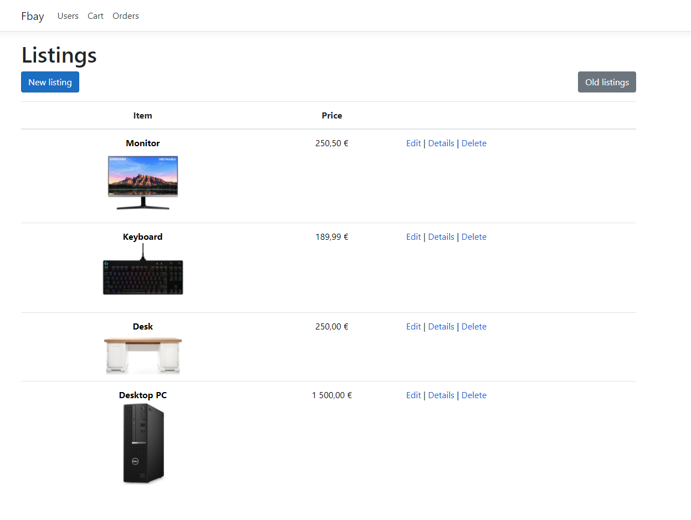

# Fbay
Marketplace using .NET Core MVC

This project is just my way of learning the basics of .NET Core MVC and is not meant to become an actual usable base for a marketplace.

Front page shows purchasable items
  
Clicking on a listing shows stock and seller information  
  
Cart page shows items in cart and the total price, here you can choose which user to make the purchase with  
 
Order page shows all details of an order 
 
Users page shows list of users, through here you can also make new ones  
  
